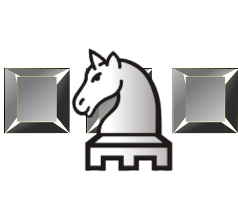

<div align="center">

  <h1><code>shuuro-wasm</code></h1>

  <strong>WebAssembly port of the <a href="https://github.com/uros-5/shuuro">shuuro rust crate</a>.</strong>

  

  <sub>Built with 🦀🕸  and <a href="https://github.com/rustwasm/wasm-bindgen">wasm-bindgen</a></sub>
</div>

## 🚴 Usage

```bash
pnpm i shuuro-wasm
```

This package also includes TypeScript type defintions.
```typescript
import { ShuuroPosition, ShuuroShop } from "shuuro-wasm";
async function init() {
  let shop = new ShuuroShop();
  let position = new ShuuroPosition("standard");
}
```

